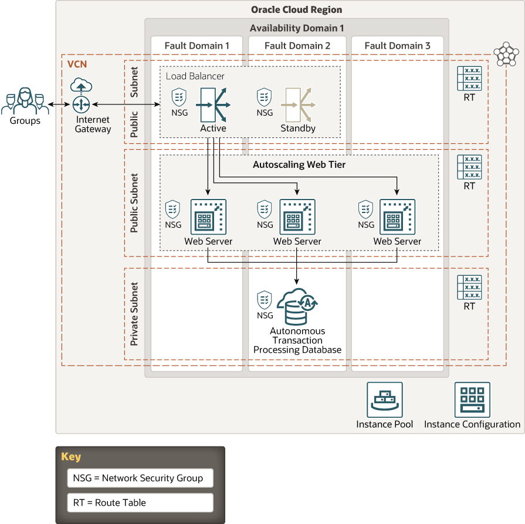

# terraform-oci-arch-autoscaling

Autoscaling ensures that your resources in the cloud are utilized efficiently and available when required. You can configure your cloud deployment to automatically adjust the compute resources based on performance metrics, such as CPU utilization. So your end users experience consistent performance even when the load is high. And your costs are proportionately low during periods of low demand.

This reference architecture shows a 3-tier topology consisting of a load balancer (LB), an autoscaling web tier, and a highly available database.

For details of the architecture, see [_Autoscale a load-balanced web application_](https://docs.oracle.com/en/solutions/autoscale-webapp/index.html)

## Prerequisites

- Permission to `manage` the following types of resources in your Oracle Cloud Infrastructure tenancy: `vcns`, `internet-gateways`, `route-tables`, `network-security-groups`, `subnets`, `autonomous-database-family`, and `instances`.

- Quota to create the following resources: 1 VCN, 2 subnets, 1 Internet Gateway, 1 NAT Gateway, 2 route rules, 1 LoadBalancer, 1 ATP database instance (+ optional standby), and 3 compute instances (plus max 2 more as a result of autoscaling).

If you don't have the required permissions and quota, contact your tenancy administrator. See [Policy Reference](https://docs.cloud.oracle.com/en-us/iaas/Content/Identity/Reference/policyreference.htm), [Service Limits](https://docs.cloud.oracle.com/en-us/iaas/Content/General/Concepts/servicelimits.htm), [Compartment Quotas](https://docs.cloud.oracle.com/iaas/Content/General/Concepts/resourcequotas.htm).

## Deploy Using Oracle Resource Manager

1. Click [](https://cloud.oracle.com/resourcemanager/stacks/create?region=home&zipUrl=https://github.com/oracle-devrel/terraform-oci-arch-autoscaling/releases/latest/download/terraform-oci-arch-autoscaling-stack-latest.zip)

    If you aren't already signed in, when prompted, enter the tenancy and user credentials.

2. Review and accept the terms and conditions.

3. Select the region where you want to deploy the stack.

4. Follow the on-screen prompts and instructions to create the stack.

5. After creating the stack, click **Terraform Actions**, and select **Plan**.

6. Wait for the job to be completed, and review the plan.

    To make any changes, return to the Stack Details page, click **Edit Stack**, and make the required changes. Then, run the **Plan** action again.

7. If no further changes are necessary, return to the Stack Details page, click **Terraform Actions**, and select **Apply**. 

## Deploy Using the Terraform CLI

### Clone the Module
Now, you'll want a local copy of this repo. You can make that with the commands:

    git clone https://github.com/oracle-devrel/terraform-oci-arch-autoscaling.git
    cd terraform-oci-arch-autoscaling
    ls

### Set Up and Configure Terraform

1. Complete the prerequisites described [here](https://github.com/cloud-partners/oci-prerequisites).

2. Create a `terraform.tfvars` file, and specify the following variables:

```
# Authentication
tenancy_ocid         = "<tenancy_ocid>"
user_ocid            = "<user_ocid>"
fingerprint          = "<finger_print>"
private_key_path     = "<pem_private_key_path>"

# database
ATP_password           = "<ATP_user_password>"

# Region
region = "<oci_region>"

# Compartment
compartment_ocid = "<compartment_ocid>"

````


### Create the Resources
Run the following commands:

    terraform init
    terraform plan
    terraform apply

### Destroy the Deployment
When you no longer need the deployment, you can run this command to destroy the resources:

    terraform destroy

## Deploy as a Module
It's possible to utilize this repository as remote module, providing the necessary inputs:

```
module "oci-arch-autoscaling" {
  source           = "github.com/oracle-devrel/terraform-oci-arch-autoscaling"
  tenancy_ocid     = "<tenancy_ocid>"
  user_ocid        = "<user_ocid>"
  fingerprint      = "<user_ocid>"
  region           = "<oci_region>"
  private_key_path = "<private_key_path>"
  compartment_ocid = "<compartment_ocid>"
  ATP_password     = "<ATP_password>"
}
```

## Architecture Diagram



## Contributing
This project is open source.  Please submit your contributions by forking this repository and submitting a pull request!  Oracle appreciates any contributions that are made by the open source community.

## License
Copyright (c) 2021 Oracle and/or its affiliates.

Licensed under the Universal Permissive License (UPL), Version 1.0.

See [LICENSE](LICENSE) for more details.


